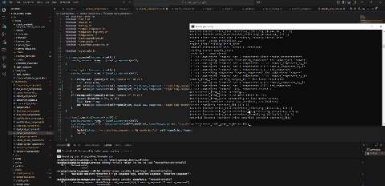
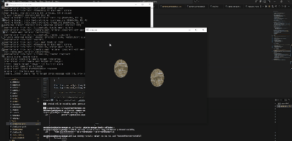

# c_sdl3_game_engine

A 3D game engine written from scratch in C, built on SDL3 and OpenGL 3.3 Core. Entities are composed from components, and scenes, prefabs and materials are defined in JSON, so simulation parameters can be changed without recompiling.

The engine currently runs a rigid body simulation with sphere-sphere and sphere-AABB collision response, textured meshes, a material system and peer-to-peer LAN multiplayer.

Two instances of a Pong scene running on the same LAN, each owning its own paddle:

## Features

**Component architecture.** A `GameObject` is a container for components with an `awake` / `start` / `update` / `destroy` lifecycle. Component types register themselves in a registry keyed by string id, so JSON deserialisation resolves types through a lookup rather than a hardcoded switch.

**Rigid body physics.** Force accumulation, gravity, per-body mass and kinematic bodies. Collision detection covers sphere-sphere and sphere-AABB pairs, producing a contact normal and penetration depth; the response derives restitution and friction from the physics material assigned to each body.

**Broad phase.** A uniform spatial grid partitions the world so narrow-phase tests run only on candidate pairs rather than every object pair.

**Rendering.** OpenGL 3.3 Core with meshes and materials loaded from JSON, diffuse, specular and normal maps, per-fragment lighting, and a debug renderer for visualising collision volumes.

**Asset pipeline.** Prefabs, scenes, materials and physics materials are separate JSON files. An id-to-path index is regenerated on every build, and resources are loaded by id rather than by path.

**LAN multiplayer.** Peer-to-peer state replication over UDP between two instances on the same network. A `network_manager_component` owns a single non-blocking socket: the instance started without a peer address binds its port and adopts the first sender it hears from as its peer, the other one is given the address up front. Objects opt in by carrying a `network_gameObject_component` with an `owner` field, which registers them with the manager. Each instance sends transforms only for the objects it owns, at a fixed 50 ms tick, and objects it does not own are forced kinematic so incoming packets are the only thing that moves them. A packet is a 32-byte object name followed by position, rotation and scale, and packets from any address other than the peer are dropped.

**Input.** Keyboard state with per-frame edge detection for presses and releases and key pairs readable as an axis, plus gamepad support through SDL3 covering buttons, axes and deadzone handling.

## Current limitations

`soft_body_component` and `spring_component` are present in the tree but the soft body simulation is unfinished. Networking is limited to two peers on a LAN and has no interpolation, delta compression or reconnection handling; port and peer address are read from stdin at startup. Audio and UI are not implemented.

## Built with

[SDL3](https://www.libsdl.org/) for windowing, GL context and gamepad input, [glad](https://glad.dav1d.de/) as the OpenGL loader, [cglm](https://github.com/recp/cglm) for math, [cJSON](https://github.com/DaveGamble/cJSON) for parsing and [stb_image](https://github.com/nothings/stb) for texture loading. Everything except SDL3 is vendored in the repository.
